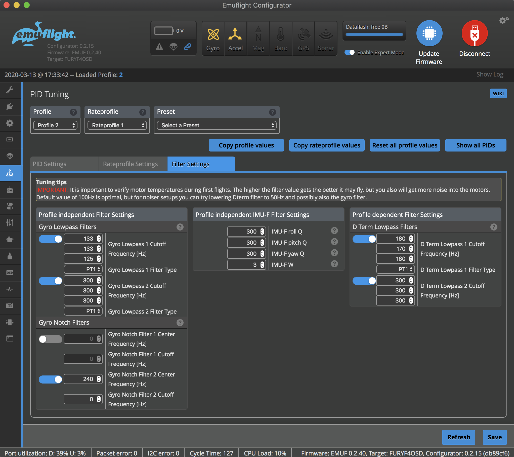
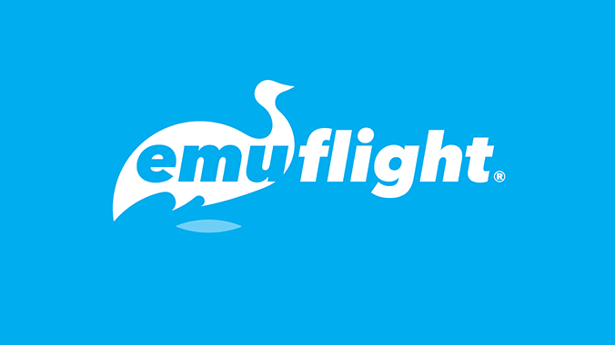

# Emuflight Configurator

**Emuflight Configurator** is a crossplatform configuration tool for the [Emuflight](https://github.com/emuflight) flight control system.



Supports quadcopters, hexacopters, octocopters, and fixed-wing aircraft. Configure any [supported Emuflight target](https://github.com/emuflight/EmuFlight/tree/master/src/main/target).

## Downloads

Please [download our releases](https://github.com/emuflight/EmuConfigurator/releases) at GitHub.

## Installation

Download the installer for your platform from the [Releases](https://github.com/emuflight/EmuConfigurator/releases) page.

**macOS:** Right-click the app and select **Open** to bypass Gatekeeper on first launch.

## Support

- [Emuflight Discord](https://discord.gg/gdP9CwE)
- [Configurator issues](https://github.com/emuflight/EmuConfigurator/issues)
- [Firmware issues](https://github.com/emuflight/EmuFlight/issues)

---

## Development

### Requirements

1. [Node.js](https://nodejs.org/en/) (LTS recommended)
2. [nvm](https://github.com/nvm-sh/nvm) (Node version manager; optional but recommended for reproducible local Node versions)
3. [Yarn](https://yarnpkg.com/) (`npm install -g yarn`)

### Commands

| Command | Description |
|---------|-------------|
| `yarn dev` | Start dev mode with devtools |
| `yarn debug` | Alias for `yarn dev` |
| `yarn build` | Build `dist/` only |
| `yarn make` | Create release packages (all platforms) |
| `yarn make:dev` | Alias for `yarn make:debug` |
| `yarn make:debug` | Create debug packages with the DevTools menu enabled |
| `yarn package` | Build an unpacked application package |
| `yarn package:debug` | Build an unpacked debug package |
| `yarn commands` | Show the available project commands |
| `yarn lint` | Run ESLint |

### Build Output

- `dist/` — assembled app sources
- `out/make/` — packaged applications and installers

**Platform packages:**

- **macOS**: ZIP always, DMG local only (requires `macos-alias`)
- **Windows**: EXE installer
- **Linux**: DEB + RPM

### macOS DMG Building

**CI (GitHub Actions):** Builds ZIP only (portable, suitable for distribution)

**Local Dev:** To build DMG locally (macOS only):

```bash
brew install macos-alias   # One-time install
yarn make                   # Builds both .zip and .dmg
```

DMG is skipped in CI because `macos-alias` (native module) doesn't
cross-compile reliably. ZIP is portable and sufficient for most use cases.

### Platform Notes

#### Linux: Serial Port Access

```bash
sudo usermod -aG dialout $USER
# Log out and back in
```

#### Linux: USB DFU Flashing

Create `/etc/udev/rules.d/49-stm32dfu.rules`:

```text
SUBSYSTEM=="usb", ATTRS{idVendor}=="0483", ATTRS{idProduct}=="df11", \
MODE="0664", GROUP="plugdev"
```

Then: `sudo udevadm control --reload-rules && sudo udevadm trigger`

---


